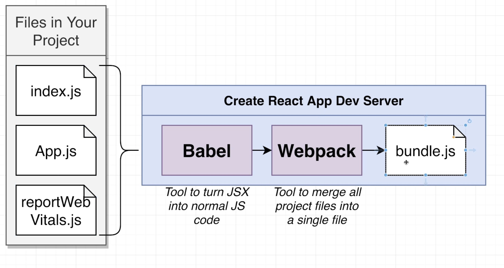

# react-redux-stephen
[Udemy tutorial of Stephen Grider](https://www.udemy.com/course/react-redux/learn/lecture/34693336#overview)


# 1. Dive in!

## 1.1 Critical questions
### 1. What's  React all about?
    - React displays HTML
    - changes that HTML when the user does something
    - JSX (JavaScript XML) looks like HTML. tells react to..
        - tell react to create a normal HTML element
        - tell react to show another component


### 2. How does a React app start up?
1. all of your projects JSs files are 'bundled' together into a single file, then placed into a server
    - 

2. user makes a request to the server and gets an HTML file + the bundle
    - 

3. users' browser executes your code
    - 
    

### 3. what were the 'useState' functions?
- `useState` is a function that works with React's 'state' system
- State is like a variable in React
- State is used to store data that changes over time
- whenever state changes, React automatically updates content on the screen

- Our app had three pieces of data that changed
    1. the text the user typed into the text input
    2. language the user wanted to translate text to
    3. the result of the translation


### 4. How did the text get translated to another language
- 


## 1.2 Node setup
1. download from [node](https://nodejs.org/en/download/package-manager)
2. create a new project folder
```bash
$ npm create-react-app <prject_name>

# 1. start your project
# 1.1 to the project folder
# 1.2 
$ npm start

# 2. view your project
# 2.1 open browser then localhost:3000

# 3. stop your project
$ control + c

# 4. build your app for deployment
$ npm run build
```

3. what happened when start React app
    - 

4. all files listed in project and it function
    - 

5. Files we are realling working on
    - 